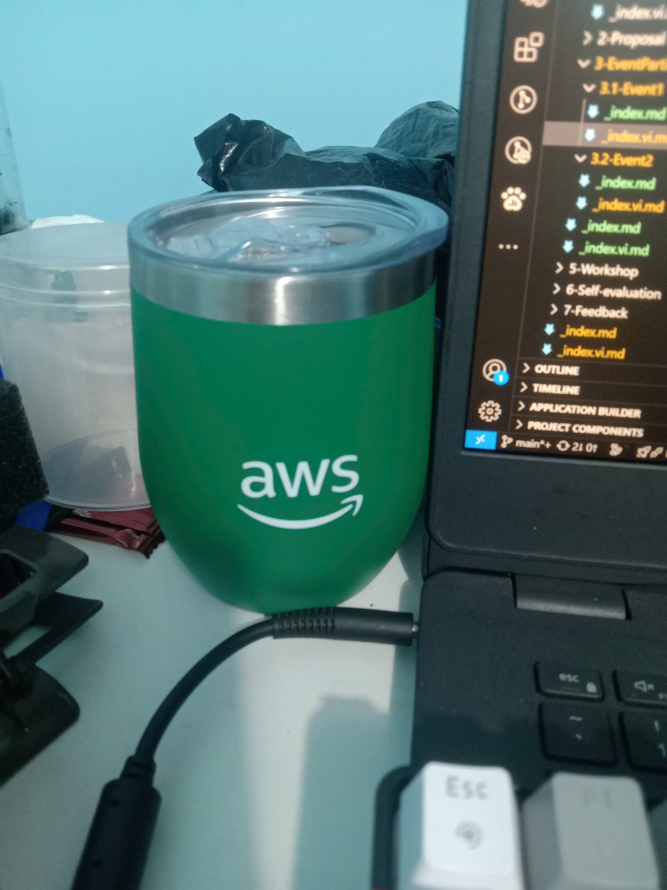

### Mục Đích Của Sự Kiện

- Tổng hợp và chắt lọc những công bố dịch vụ, sản phẩm mới nhất mang tính đột phá từ kỳ hội nghị điện toán đám mây lớn nhất toàn cầu - AWS re:Invent.
- Mang các giải pháp công nghệ toàn cầu về gần gũi hơn với ngữ cảnh thực tế của doanh nghiệp Việt Nam thông qua các tiêu chuẩn kiến trúc tối ưu.
- Tạo ra một không gian kết nối sôi động cho cộng đồng Builder, các lập trình viên và những người đam mê Cloud tại khu vực TP.HCM.

### Danh Sách Diễn Giả
- **Đội ngũ Solutions Architect (SA) từ AWS Việt Nam:** Đảm nhận việc cập nhật các xu hướng cốt lõi và hướng dẫn chuyên sâu về kiến trúc hạ tầng.
- **Các AWS Community Builders & Ambassadors tại Việt Nam:** Chia sẻ các case-study thực chiến, demo trực tiếp (hands-on) và kinh nghiệm tối ưu hóa chi phí/hiệu năng trên môi trường Cloud.
- **Đại diện từ các doanh nghiệp đối tác (AWS Partners):** Bàn luận về xu hướng ứng dụng AI và chuyển đổi số tại thị trường Việt Nam.

### Nội Dung Nổi Bật

#### Cập nhật các Dịch vụ và Tính năng mới
- Điểm lại những nâng cấp đáng giá nhất về Compute (EC2, Serverless), Storage (S3, EBS) và Database (RDS, DynamoDB).
- Nhấn mạnh vào xu hướng tự động hóa và tối ưu hóa chi phí vận hành cho các doanh nghiệp đang trong giai đoạn scale-up (mở rộng quy mô).

#### Sự trỗi dậy của Generative AI và Machine Learning
- Khám phá cách AWS đang "bình dân hóa" Trí tuệ nhân tạo thông qua các dịch vụ như Amazon Bedrock và Amazon Q.
- Thảo luận về cách tích hợp AI vào quy trình phát triển phần mềm (SDLC) để tăng cường năng suất của lập trình viên (AI-assisted coding).

#### Bảo mật Đám mây (AWS Cloud Security) và Resilience
- Cập nhật các cơ chế phòng thủ mới, cách thiết lập Zero Trust trên đám mây và nâng cao khả năng giám sát tự động.
- Phương pháp xây dựng hệ thống có khả năng phục hồi cao (Resilience), đảm bảo tính sẵn sàng cao trước mọi sự cố bất ngờ.

### Những Gì Học Được

#### Tư Duy Thiết Kế 
- Hiểu sâu hơn về triết lý "Customer Obsession" (Ám ảnh khách hàng) của AWS: Mọi dịch vụ công nghệ sinh ra đều để giải quyết một bài toán kinh doanh cụ thể của người dùng. Từ đó, tôi rèn luyện được tư duy thiết kế hệ thống đi từ nhu cầu thực tế thay vì chạy theo xu hướng công nghệ.

#### Kiến Trúc Kỹ Thuật
- Nắm vững các mô hình triển khai Microservices và Serverless hiện đại nhất.
- Cập nhật kiến thức về cách AI/ML đang được nhúng thẳng vào tầng hạ tầng, đồng thời nhận diện được các bề mặt tấn công mới có thể phát sinh khi ứng dụng AI.

#### Vận Hành & Bảo Mật
- Thấu hiểu rõ hơn mô hình Bảo mật chia sẻ (Shared Responsibility Model). Môi trường Cloud cung cấp công cụ an toàn, nhưng việc cấu hình các dịch vụ như IAM, Security Groups,... để không xảy ra rò rỉ dữ liệu lại nằm ở tư duy của người quản trị.

### Ứng Dụng Vào Công Việc 

- **Tối ưu kiến trúc đồ án:** Áp dụng trực tiếp các tiêu chuẩn (Best Practices) học được để rà soát lại dự án *FPT Event Management System*, đặc biệt trong việc cấu trúc mạng (VPC, Subnets) và tối ưu hóa chi phí trước khi deploy lên AWS.
- **Cập nhật Security Checklist:** Bổ sung các test cases mới liên quan đến lỗ hổng cấu hình Cloud (Cloud Misconfiguration), đặc biệt là rủi ro phân quyền IAM và bộc lộ bucket S3.
- **Nâng cấp tư duy Pentest:** Việc lắng nghe trực tiếp cách các Solutions Architect xây dựng hệ thống phòng thủ giúp tôi có một lăng kính rõ nét hơn. Muốn trở thành một Pentester/Red Teamer xuất sắc trên nền tảng Cloud, trước hết phải nắm rõ tư duy của những "Builder" - người xây dựng ra nó.

### Trải nghiệm trong sự kiện 

Sự kiện diễn ra tại tòa tháp Bitexco Financial Tower mang đến một không gian công nghệ đậm chất hiện đại và cởi mở ngay giữa trung tâm Sài Gòn.

#### Nắm bắt thực tế thị trường
- Thay vì chỉ đọc tài liệu tiếng Anh, việc nghe các chuyên gia người Việt chia sẻ giúp tôi nhận ra những nỗi đau thực tế mà các doanh nghiệp trong nước đang gặp phải khi chuyển dịch lên Cloud, từ đó định hướng lộ trình học tập sát với nhu cầu tuyển dụng.

#### Giao lưu và kết nối chuyên môn
- Bầu không khí sự kiện rất năng động. Những buổi thảo luận bên lề với các anh chị đi trước là cơ hội vàng để tôi trau dồi thêm kinh nghiệm thực chiến và hiểu rõ hơn về lộ trình nghề nghiệp trong mảng Cloud Security.

#### Bài học đọng lại
- Công nghệ đám mây thay đổi chóng mặt. Việc chủ động bước ra ngoài, tham gia các cộng đồng chuyên môn mạnh mẽ như AWS Vietnam là cách tốt nhất để không bị tụt hậu và giữ được "lửa" đam mê với ngành An toàn thông tin.

#### Ảnh quà lưu niệm ban tổ chức tặng sau sự kiện

> Tổng kết lại, sự kiện không chỉ là một buổi báo cáo thông tin đơn thuần mà còn là đòn bẩy tư duy tuyệt vời, tiếp thêm cho tôi động lực và kiến thức vững chắc để hoàn thiện kỳ thực tập cũng như dự án sắp tới.